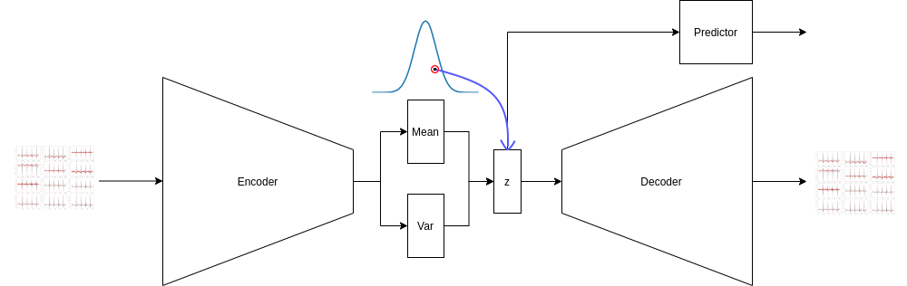
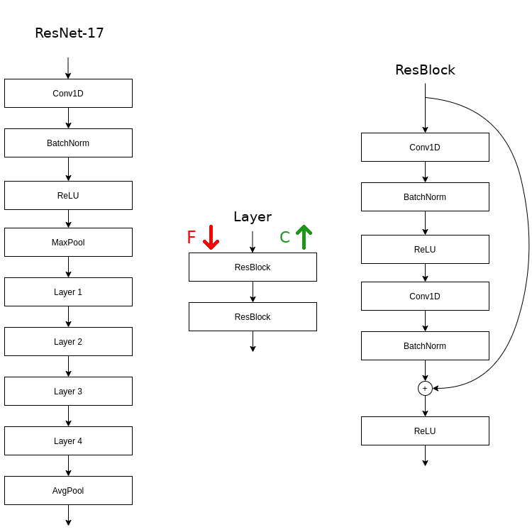

# cvd-vae
A package for running experiments with VAEs for ECG data. The focus is on survival analysis by looking at CVD events, although it could be used for similar data with some tweaks. The model is a typical VAE but with a predictive branch off the latent dimension, as depicted in the figure below.

Both the encoder and decoder are based off a ResNet-18 but with 1D convolutions and the final fully connected layer removed to give the desired shaped outputs. Hence this is labelled a ResNet-17 in the diagram of the encoder model below. The arrows labelled "F" and "C" refer to the decrease in feature size and increase in channels at that layer.

